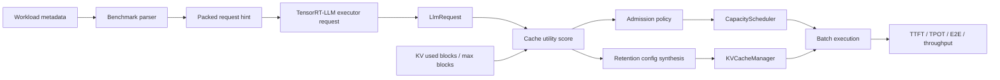
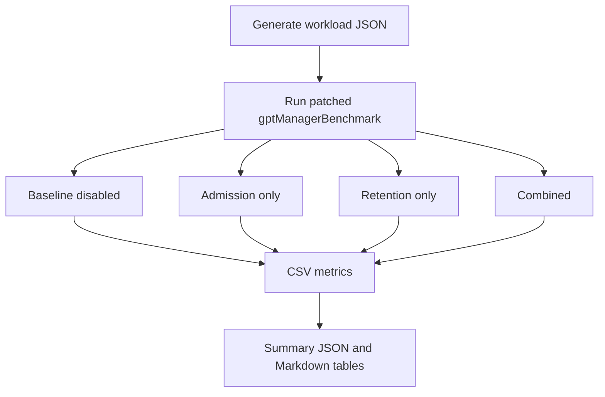

# TensorRT-LLM MoE KV Scheduler

[](LICENSE)
[](https://github.com/NVIDIA/TensorRT-LLM)


MoE-aware request admission and KV cache retention for NVIDIA TensorRT-LLM.

This repository contains a runtime scheduling patch for TensorRT-LLM. It adds a default-off policy that uses request-level MoE pressure and prefix reuse hints to decide which requests should be admitted first under KV cache pressure, and which reusable prefix ranges should receive higher KV retention priority.

The project is evaluated with a real TensorRT-LLM engine for `Qwen/Qwen1.5-MoE-A2.7B-Chat` using INT4 weight-only quantization. The main positive result is on a mixed KV-pressure workload:

```text
mixed_burst + admission_only:
TTFT p90   -3.42%
TPOT p90   -4.48%
E2E p90    -2.39%
Throughput +3.40%
```

This is a patch-oriented engineering project. It is not a standalone inference server, not a new MoE kernel, and not an official TensorRT-LLM feature.

## What This Project Is

| Question | Answer |
| --- | --- |
| What is modified? | TensorRT-LLM C++ runtime scheduling and KV retention paths. |
| What is not modified? | CUDA MoE kernels, TensorRT engine layers, tokenizer, model weights, or the model architecture. |
| What is the optimization target? | Request admission and prefix KV retention under KV cache pressure. |
| What model was used for live benchmarking? | `Qwen/Qwen1.5-MoE-A2.7B-Chat`, TensorRT-LLM INT4 weight-only engine. |
| Is it enabled by default? | No. The policy is controlled by environment variables and is disabled when those variables are unset. |
| Is it upstream TensorRT-LLM behavior? | No. It is an external prototype patch applied on top of TensorRT-LLM. |
| Does it use real runtime expert telemetry? | No. The benchmark uses explicit `synthetic_hint` metadata. Production use should replace that with router or serving-layer metadata. |

## Terminology

| Term | Meaning in this project |
| --- | --- |
| TensorRT-LLM | NVIDIA's runtime and optimization stack for large language model inference on NVIDIA GPUs. |
| MoE | Mixture of Experts. A model architecture where tokens are routed to a subset of expert feed-forward networks instead of using one dense feed-forward network for every token. |
| Expert pressure | A request-level hint that estimates how expensive or congested the MoE expert path may be for a request. In this prototype it comes from workload metadata, not live router counters. |
| KV cache | The cached key/value tensors used by attention during autoregressive decoding. Reusing KV cache avoids recomputing previous tokens. |
| Prefix reuse | Multiple requests share the same prompt prefix, so cached KV blocks for that prefix can be reused. |
| Cache pollution | Low-reuse long prompts occupy many KV blocks and can evict high-value reusable prefixes. |
| Admission | The runtime decision that selects which pending requests enter the active batch. |
| Retention | A priority hint telling the KV cache manager which token ranges should be harder to evict. |
| TTFT | Time To First Token. Latency from request start until the first generated token. Lower is better. |
| TPOT | Time Per Output Token. Inter-token latency during generation. Lower is better. |
| E2E latency | End-to-end sequence latency. Lower is better. |
| Throughput | Generated tokens per second. Higher is better. |
| p90 | 90th percentile. For latency, it approximates tail behavior instead of only reporting average latency. |

## Problem

TensorRT-LLM already has a strong batching and KV cache implementation. The missing signal explored here is request value under MoE-specific KV pressure.

Consider this queue:

```text
Request A: long unique prompt, no expected prefix reuse
Request B: shared prefix used by many later requests
Request C: same shared prefix as B
Request D: same shared prefix as B
```

If KV cache is tight and the runtime admits `A` first, `A` may allocate many KV blocks that are unlikely to be reused. Those blocks can crowd out or evict the shared prefix used by `B/C/D`. For an MoE model, recomputing that shared prefix may also repeatedly hit expensive or hot expert paths.

The policy in this repository asks a narrower question:

```text
When KV cache is under pressure, can TensorRT-LLM admit high-reuse,
high-recompute-cost requests before low-reuse cache-polluting requests?
```

## Design

The policy assigns each request a cache utility score:

```text
cache_utility =
  prefix_reuse_value
  + recompute_cost
  + moe_pressure_cost
  - cache_pollution_cost
```

Each term has a concrete meaning:

| Term | What increases it | Why it matters |
| --- | --- | --- |
| `prefix_reuse_value` | More shared prefix tokens and higher expected reuse count. | Reusable prefixes are worth preserving because later requests can avoid recomputing them. |
| `recompute_cost` | Longer prompts. | Recomputing a long prompt is more expensive than recomputing a short one. |
| `moe_pressure_cost` | Higher request MoE pressure score. | A prefix that is expensive through MoE experts should be protected more strongly. |
| `cache_pollution_cost` | More estimated KV blocks that are not part of a reusable prefix. | Large low-reuse prompts can evict useful cache content. |

The score is intentionally simple. It is not trying to model the entire TensorRT-LLM runtime. It is a request-level scheduling hint used only when KV pressure is high.

## Runtime Flow



Step by step:

1. The benchmark workload JSON contains request metadata such as `shared_prefix_tokens` and `moe_pressure_score`.
2. The benchmark parser reads that metadata and packs it into a 64-bit request hint.
3. The hint is transported through `executor::Request::clientId` in this prototype.
4. TensorRT-LLM creates an internal `LlmRequest`.
5. The patched scheduler recovers the hint through `LlmRequest::getClientId()`.
6. When KV cache usage crosses a configured watermark, the scheduler computes cache utility.
7. In admission mode, low-utility first-context requests can be deferred if a later high-utility request is waiting.
8. In retention mode, reusable prefix token ranges receive a priority derived from cache utility.
9. The benchmark compares latency and throughput against the same patched binary with the policy disabled.

The `clientId` transport is a prototype choice. It keeps the patch compact for benchmarking. A production implementation should add an explicit metadata path from the serving router or request scheduler.

## What Changed in TensorRT-LLM

| Area | Files | Change | Reason |
| --- | --- | --- | --- |
| Signal ingress | `benchmarks/cpp/utils/utils.{h,cpp}`, `benchmarks/cpp/gptManagerBenchmark.cpp` | Adds parsing for MoE/KV scheduling fields and packs them into request metadata. | The runtime needs request-level hints before admission. |
| Shared policy logic | `cpp/include/tensorrt_llm/batch_manager/moeKvSchedulingPolicy.h` | Adds env config, hint packing/unpacking, KV pressure calculation, and cache utility scoring. | Keeps the policy self-contained and easy to disable. |
| Request metadata access | `cpp/include/tensorrt_llm/batch_manager/llmRequest.h` | Adds `getClientId()`. | Lets the batch manager recover benchmark metadata from internal requests. |
| Admission scheduling | `cpp/tensorrt_llm/batch_manager/capacityScheduler.cpp` | Adds KV-pressure-gated deferral and utility-based pending request ordering. | Prevents low-reuse prompts from consuming scarce KV blocks before high-reuse prefixes. |
| Prefix retention | `cpp/tensorrt_llm/batch_manager/kvCacheManager.cpp` | Synthesizes `KvCacheRetentionConfig` for useful shared prefix ranges when no explicit retention config exists. | Reuses TensorRT-LLM's existing retention/eviction mechanism instead of rewriting allocator internals. |

## Request Metadata Schema

The benchmark workload accepts these optional fields per sample:

| Field | Type | Meaning |
| --- | --- | --- |
| `moe_pressure_score` | float, usually `0.0` to `1.0` | Estimated MoE pressure or recompute cost multiplier for the request. |
| `reuse_group` | integer | Identifier for requests expected to share a prefix. |
| `shared_prefix_tokens` | integer | Number of prompt tokens that are expected to be reusable across the reuse group. |
| `estimated_kv_blocks` | integer | Approximate number of KV blocks the request will occupy. |
| `expected_reuse_count` | integer | Expected number of future requests that may reuse the prefix. |
| `signal_source` | string | Source of the signal. Current benchmark uses `synthetic_hint`. |

Example:

```json
{
  "task_id": 17,
  "input_ids": [151644, 8948, 198, 1310],
  "output_len": 96,
  "moe_pressure_score": 0.89,
  "reuse_group": 10,
  "shared_prefix_tokens": 112,
  "estimated_kv_blocks": 4,
  "expected_reuse_count": 16,
  "signal_source": "synthetic_hint"
}
```

If these fields are absent, the patch falls back to baseline behavior because no valid scheduling hint can be unpacked.

## Runtime Modes

The same patched binary supports four modes:

| Mode | Environment | Behavior |
| --- | --- | --- |
| Baseline disabled | No MoE KV scheduling env vars set | TensorRT-LLM runs without the new policy. This is the comparison baseline. |
| Admission only | `TRTLLM_MOE_KV_ADMISSION_ENABLE=1` | Uses cache utility to influence request admission under KV pressure. |
| Retention only | `TRTLLM_MOE_KV_RETENTION_ENABLE=1` | Uses cache utility to assign retention priority to shared prefix ranges. |
| Combined | Both admission and retention enabled | Runs both policy components together. |

Default benchmark knobs:

```bash
TRTLLM_MOE_KV_HIGH_WATERMARK_PCT=50
TRTLLM_MOE_KV_WEIGHT_REUSE=1.35
TRTLLM_MOE_KV_WEIGHT_RECOMPUTE=1.00
TRTLLM_MOE_KV_WEIGHT_PRESSURE=0.55
TRTLLM_MOE_KV_WEIGHT_POLLUTION=1.10
TRTLLM_MOE_KV_MIN_ADMIT_UTILITY=35
TRTLLM_MOE_KV_DEFER_MARGIN=8
TRTLLM_MOE_KV_PREFIX_PRIORITY_BASE=45
TRTLLM_MOE_KV_PREFIX_PRIORITY_MAX=95
TRTLLM_MOE_KV_DURATION_MS=9000
```

`TRTLLM_MOE_KV_HIGH_WATERMARK_PCT=50` means the policy starts to act only after at least half of the available paged KV cache budget is used. Below the watermark, normal TensorRT-LLM scheduling is preserved.

## Benchmarks

The benchmark uses TensorRT-LLM C++ `gptManagerBenchmark` with inflight batching.

| Item | Value |
| --- | --- |
| GPU | NVIDIA GeForce RTX 4060 Ti, 16 GB |
| Model | `Qwen/Qwen1.5-MoE-A2.7B-Chat` |
| Engine | TensorRT-LLM INT4 weight-only |
| Runtime | TensorRT-LLM C++ `gptManagerBenchmark`, inflight batching |
| Samples | 64 per workload and mode |
| Concurrency | 4 |
| Baseline | Same patched binary with policy env vars disabled |

Workloads:

| Workload | What it represents | Expected policy behavior |
| --- | --- | --- |
| `balanced_control` | Requests are balanced and do not provide a strong reuse contrast. | The policy should not help much and should avoid large regressions. |
| `repeated_prefix_hot_pressure` | Most requests share hot prefixes. | Retention may help, but admission has less contrast because many requests are valuable. |
| `mixed_burst` | Low-reuse prompts arrive before high-reuse shared-prefix requests. | Admission can improve results by admitting high-utility requests earlier under KV pressure. |
| `low_reuse_pollution` | Long prompts have low prefix reuse. | The policy should avoid over-protecting low-value cache residents. |

Benchmark pipeline:



## Results

Latency deltas are lower-is-better. Throughput deltas are higher-is-better.

| Workload | Mode | TTFT p90 | TPOT p90 | E2E p90 | Throughput |
| --- | --- | ---: | ---: | ---: | ---: |
| balanced_control | admission_only | +1.16% | +1.22% | +0.86% | -0.41% |
| balanced_control | retention_only | +1.08% | +0.94% | +0.71% | -0.18% |
| balanced_control | combined | +7.47% | +7.87% | +4.73% | -4.27% |
| repeated_prefix_hot_pressure | admission_only | +0.92% | +2.03% | +2.43% | -0.94% |
| repeated_prefix_hot_pressure | retention_only | +0.02% | +0.65% | +1.24% | +0.11% |
| repeated_prefix_hot_pressure | combined | -0.02% | +1.32% | +1.01% | -0.75% |
| mixed_burst | admission_only | **-3.42%** | **-4.48%** | **-2.39%** | **+3.40%** |
| mixed_burst | retention_only | +0.12% | -1.40% | +2.29% | +0.49% |
| mixed_burst | combined | -3.00% | -3.54% | -0.38% | +1.93% |
| low_reuse_pollution | admission_only | +0.46% | +0.79% | -0.31% | -0.34% |
| low_reuse_pollution | retention_only | -1.04% | -1.03% | -2.30% | -0.88% |
| low_reuse_pollution | combined | +2.15% | +0.39% | +3.91% | -1.84% |

Raw values:

```text
results/moe_kv_scheduling_live/compare_tables/live_summary.md
results/moe_kv_scheduling_live/compare_tables/live_summary.json
```

## How to Read the Results

The clearest positive result is `mixed_burst` with `admission_only`. That is the scenario where the policy has a useful decision to make: early low-reuse prompts would otherwise consume KV blocks before later high-reuse shared-prefix requests arrive.

`retention_only` is weaker because it acts after admission. It can increase priority for useful prefix ranges, but it cannot stop a low-value request from entering the active batch first.

`combined` is not always better than `admission_only`. Combining retention with admission can over-protect some prefix ranges and reduce scheduling flexibility. This is why the project reports ablation modes separately instead of presenting only the best combined number.

`balanced_control` and `repeated_prefix_hot_pressure` are not headline wins. This is intentional to report. The policy is workload-sensitive: it is designed for mixed high-reuse and low-reuse pressure, not as a universal latency improvement.

## Reproduce

Clone this repository:

```bash
git clone https://github.com/LongWeihan/trtllm-moe-kv-scheduler.git
cd trtllm-moe-kv-scheduler
```

Apply the optimization patch to a clean TensorRT-LLM checkout:

```bash
cd /workspace/TensorRT-LLM
git apply /workspace/project/trtllm_patch/0001-moe-aware-kv-scheduling.patch
```

The optimization patch is `0001-moe-aware-kv-scheduling.patch`. The `0000-local-build-fixes.patch` file is not part of the scheduling method. It records build-environment fixes used during validation, including a Conan lock-file mismatch and Torch runtime link ordering. Apply it only if your TensorRT-LLM build fails for the same local build reasons:

```bash
git apply /workspace/project/trtllm_patch/0000-local-build-fixes.patch
```

Build TensorRT-LLM with your normal build flow. The validated build produced:

```text
cpp/build/tensorrt_llm/libtensorrt_llm.so
cpp/build/benchmarks/gptManagerBenchmark
```

Prepare or reuse a compatible TensorRT-LLM engine, then run:

```bash
PROJECT_DIR=/workspace/project \
TRTLLM_DIR=/workspace/TensorRT-LLM \
ENGINE_DIR=/workspace/engine \
bash scripts/run_moe_kv_scheduling_live_matrix.sh
```

Environment variables used by the run script:

| Variable | Meaning |
| --- | --- |
| `PROJECT_DIR` | Path to this repository inside the benchmark container or shell. |
| `TRTLLM_DIR` | Path to the patched TensorRT-LLM checkout. |
| `ENGINE_DIR` | Path to a built TensorRT-LLM engine directory, expected to contain files such as `config.json` and `rank0.engine`. |

The validated benchmark used a Qwen1.5-MoE INT4 weight-only engine. The engine itself is not committed because TensorRT engine files are large generated artifacts.

To regenerate workloads:

```bash
python3 scripts/generate_moe_kv_scheduling_workloads.py
```

To summarize existing CSV outputs:

```bash
python3 scripts/summarize_moe_kv_scheduling_live.py
```

## Repository Layout

```text
.
├── docs/
│   ├── architecture.md
│   ├── benchmark_results.md
│   └── build_and_reproduce.md
├── results/
│   └── moe_kv_scheduling_live/compare_tables/
├── scripts/
│   ├── generate_moe_kv_scheduling_workloads.py
│   ├── run_moe_kv_scheduling_live_matrix.sh
│   └── summarize_moe_kv_scheduling_live.py
├── trtllm_patch/
│   ├── 0000-local-build-fixes.patch
│   └── 0001-moe-aware-kv-scheduling.patch
└── workloads/
    └── moe_kv_scheduling/
```

## Limitations

This project is not affiliated with or endorsed by NVIDIA. It is an external runtime scheduling prototype for TensorRT-LLM.

The current signal source is `synthetic_hint`. The benchmark metadata estimates MoE pressure and prefix reuse, but the TensorRT engine does not expose live selected-expert counters to this policy. A production implementation should connect the policy to router telemetry or a serving-layer estimator.

The project is benchmarked on a single GPU. It does not claim expert-parallel, multi-GPU, cross-rank KV movement, or distributed serving improvements.

The baseline uses the same patched binary with policy environment variables disabled. This isolates the scheduling policy from binary-to-binary build noise.

Large model artifacts, TensorRT engines, and logs are intentionally not committed. The repository contains patches, scripts, workload definitions, and summarized results.

One additional smaller-KV pressure sweep was excluded from headline results because TensorRT-LLM reduced max sequence length and output length in that run, making it not comparable to the main workload.

## FAQ

**Does this speed up TensorRT-LLM in every workload?**

No. The policy helps when there is a useful contrast between high-reuse and low-reuse requests under KV pressure. It can be neutral or worse when that contrast does not exist.

**Why does `admission_only` beat `combined` on the main workload?**

Admission changes which request enters the batch first. Retention changes how admitted requests protect KV blocks. In this run, the admission decision was the stronger lever, while retention added extra priority behavior that was not always beneficial.

**Why use `clientId` to pass metadata?**

It is a compact benchmark integration path. It avoids changing public request APIs for a prototype. Production code should use an explicit metadata field.

**Is `synthetic_hint` fake data?**

It is synthetic workload metadata, not random data. It encodes known properties of the generated workload, such as shared prefix length and expected reuse count. It should not be described as live MoE router telemetry.

**Does this modify MoE kernels?**

No. The patch is about runtime scheduling and KV cache policy, not CUDA kernel optimization.
