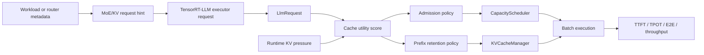
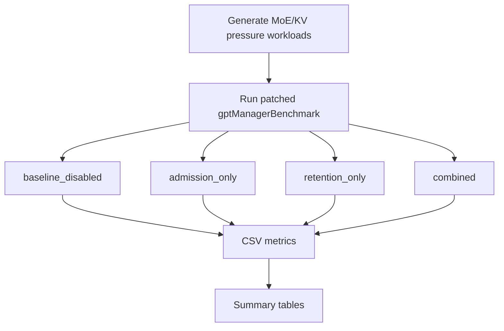

# TensorRT-LLM MoE KV Scheduler

[](https://github.com/NVIDIA/TensorRT-LLM)
[](https://developer.nvidia.com/cuda-toolkit)
[](https://www.python.org/)
[](#)
[](results/moe_kv_scheduling_live/compare_tables/live_summary.md)
[](LICENSE)

Default-off runtime scheduling patch for TensorRT-LLM MoE inference. The project adds a cache-utility signal to guide request admission and reusable-prefix KV retention under paged KV cache pressure.

This is not an inference server, not a MoE kernel rewrite, and not a replacement for TensorRT-LLM. It is a focused performance-engineering patch for the TensorRT-LLM C++ runtime path.

## Overview

TensorRT-LLM already provides a highly optimized inference stack. The remaining opportunity explored here is request-level resource allocation under KV cache pressure.

In MoE serving, not all cached prefixes have the same value. A long, low-reuse prompt can occupy many KV blocks and evict a shared prefix that will be reused by later requests. Recomputing that prefix can also re-trigger expensive MoE prefill work. A generic admission order does not know this difference before allocating scarce KV blocks.

This project introduces a request cache-utility score:

```text
cache_utility =
  prefix_reuse_value
  + recompute_cost
  + moe_pressure_cost
  - cache_pollution_cost
```

When KV usage crosses a configured high watermark, the scheduler can prefer high-utility shared-prefix requests and defer low-utility cache-polluting prompts. The same score is also used to synthesize TensorRT-LLM `KvCacheRetentionConfig` for reusable prefix ranges.

## Highlights

| Capability | Status |
| --- | --- |
| TensorRT-LLM C++ runtime patch | Implemented |
| KV-pressure-gated request admission | Implemented |
| Score-aware reusable-prefix retention | Implemented |
| Qwen1.5-MoE INT4 live benchmark | Completed |
| Runtime router telemetry | Future production extension |
| Direct allocator rewrite | Not required for this prototype |

## Architecture



The current benchmark path carries metadata through a compact packed hint. A production integration should replace this with a first-class request metadata channel from the serving router, gate estimator, or runtime telemetry layer.

## Patch Surface

| Area | TensorRT-LLM files | Purpose |
| --- | --- | --- |
| Signal ingress | `benchmarks/cpp/utils/utils.{h,cpp}`, `benchmarks/cpp/gptManagerBenchmark.cpp` | Parse MoE/KV metadata from benchmark workloads and attach it to executor requests. |
| Shared policy logic | `cpp/include/tensorrt_llm/batch_manager/moeKvSchedulingPolicy.h` | Keep env config, hint encoding, KV pressure calculation, and cache-utility scoring isolated. |
| Request metadata access | `cpp/include/tensorrt_llm/batch_manager/llmRequest.h` | Expose request metadata to the batch manager. |
| Admission scheduling | `cpp/tensorrt_llm/batch_manager/capacityScheduler.cpp` | Defer low-utility first-context requests under KV pressure when better candidates are waiting. |
| Prefix retention | `cpp/tensorrt_llm/batch_manager/kvCacheManager.cpp` | Use cache utility to generate retention priority for reusable prefix ranges. |

The main patch is:

```text
trtllm_patch/0001-moe-aware-kv-scheduling.patch
```

An optional local build patch is also included:

```text
trtllm_patch/0000-local-build-fixes.patch
```

The build patch records workspace-specific CMake/Conan fixes and is not part of the scheduling method.

## Benchmark Pipeline



The benchmark uses four synthetic but structured workloads:

| Workload | Purpose |
| --- | --- |
| `balanced_control` | Low-pressure control workload. The policy should not meaningfully help here. |
| `repeated_prefix_hot_pressure` | Many requests share hot prefixes. Tests whether retention alone protects useful KV blocks. |
| `mixed_burst` | Low-reuse prompts arrive before high-reuse shared-prefix requests. This is the target pressure scenario. |
| `low_reuse_pollution` | Long unique prompts with low reuse. Tests whether the policy over-protects bad cache residents. |

## Results

Validated with a TensorRT-LLM INT4 weight-only engine for `Qwen/Qwen1.5-MoE-A2.7B-Chat`.

| Item | Value |
| --- | --- |
| GPU | NVIDIA GeForce RTX 4060 Ti, 16 GB |
| Runtime | TensorRT-LLM C++ `gptManagerBenchmark` |
| Scheduling policy | `max_utilization` |
| Samples | 64 per workload and mode |
| Concurrency | 4 |
| Baseline | Same patched binary with MoE KV scheduling disabled |

Headline result:

| Workload | Best mode | TTFT p90 | TPOT p90 | E2E p90 | Throughput |
| --- | --- | ---: | ---: | ---: | ---: |
| `mixed_burst` | `admission_only` | **-3.42%** | **-4.48%** | **-2.39%** | **+3.40%** |

Full delta table:

| Workload | Mode | TTFT p90 | TPOT p90 | E2E p90 | Throughput |
| --- | --- | ---: | ---: | ---: | ---: |
| `balanced_control` | `admission_only` | +1.16% | +1.22% | +0.86% | -0.41% |
| `balanced_control` | `retention_only` | +1.08% | +0.94% | +0.71% | -0.18% |
| `balanced_control` | `combined` | +7.47% | +7.87% | +4.73% | -4.27% |
| `repeated_prefix_hot_pressure` | `admission_only` | +0.92% | +2.03% | +2.43% | -0.94% |
| `repeated_prefix_hot_pressure` | `retention_only` | +0.02% | +0.65% | +1.24% | +0.11% |
| `repeated_prefix_hot_pressure` | `combined` | -0.02% | +1.32% | +1.01% | -0.75% |
| `mixed_burst` | `admission_only` | **-3.42%** | **-4.48%** | **-2.39%** | **+3.40%** |
| `mixed_burst` | `retention_only` | +0.12% | -1.40% | +2.29% | +0.49% |
| `mixed_burst` | `combined` | -3.00% | -3.54% | -0.38% | +1.93% |
| `low_reuse_pollution` | `admission_only` | +0.46% | +0.79% | -0.31% | -0.34% |
| `low_reuse_pollution` | `retention_only` | -1.04% | -1.03% | -2.30% | -0.88% |
| `low_reuse_pollution` | `combined` | +2.15% | +0.39% | +3.91% | -1.84% |

Raw values are published in:

```text
results/moe_kv_scheduling_live/compare_tables/live_summary.md
results/moe_kv_scheduling_live/compare_tables/live_summary.json
```

## Interpretation

The strongest result appears on `mixed_burst` with admission-only scheduling. That is the workload where the policy has a meaningful choice: low-reuse prompts arrive first and can consume KV capacity before high-reuse shared-prefix requests enter the batch.

The policy is workload-sensitive. It is not presented as a universal TensorRT-LLM speedup. Balanced workloads and repeated-prefix workloads are mostly neutral or slightly worse because the policy either has little discrimination signal or adds scheduling overhead without preventing harmful KV allocation.

This is why the policy is default-off and pressure-gated.

## Quick Start

Clone this repository:

```bash
git clone https://github.com/LongWeihan/trtllm-moe-kv-scheduler.git
cd trtllm-moe-kv-scheduler
```

Apply the runtime patch to a clean TensorRT-LLM checkout:

```bash
cd /workspace/TensorRT-LLM
git apply /workspace/project/trtllm_patch/0001-moe-aware-kv-scheduling.patch
```

Build TensorRT-LLM with your normal build flow, then run the live benchmark matrix with a compatible engine:

```bash
PROJECT_DIR=/workspace/project \
TRTLLM_DIR=/workspace/TensorRT-LLM \
ENGINE_DIR=/workspace/engine \
bash scripts/run_moe_kv_scheduling_live_matrix.sh
```

Summarize benchmark CSVs:

```bash
python3 scripts/summarize_moe_kv_scheduling_live.py
```

## Runtime Modes

| Mode | Environment | Behavior |
| --- | --- | --- |
| `baseline_disabled` | no policy env vars | TensorRT-LLM behavior with the policy disabled |
| `admission_only` | `TRTLLM_MOE_KV_ADMISSION_ENABLE=1` | KV-pressure-gated request admission |
| `retention_only` | `TRTLLM_MOE_KV_RETENTION_ENABLE=1` | Score-aware reusable-prefix retention |
| `combined` | both env vars enabled | Admission and retention together |

Benchmark runner defaults:

```bash
TRTLLM_MOE_KV_HIGH_WATERMARK_PCT=50
TRTLLM_MOE_KV_WEIGHT_REUSE=1.35
TRTLLM_MOE_KV_WEIGHT_RECOMPUTE=1.00
TRTLLM_MOE_KV_WEIGHT_PRESSURE=0.55
TRTLLM_MOE_KV_WEIGHT_POLLUTION=1.10
TRTLLM_MOE_KV_MIN_ADMIT_UTILITY=35
TRTLLM_MOE_KV_DEFER_MARGIN=8
TRTLLM_MOE_KV_PREFIX_PRIORITY_BASE=45
TRTLLM_MOE_KV_PREFIX_PRIORITY_MAX=95
TRTLLM_MOE_KV_DURATION_MS=9000
```

## Repository Layout

```text
.
├── docs/
│   ├── architecture.md
│   ├── benchmark_results.md
│   └── build_and_reproduce.md
├── results/
│   └── moe_kv_scheduling_live/compare_tables/
├── scripts/
│   ├── generate_moe_kv_scheduling_workloads.py
│   ├── run_moe_kv_scheduling_live_matrix.sh
│   └── summarize_moe_kv_scheduling_live.py
├── trtllm_patch/
│   ├── 0000-local-build-fixes.patch
│   └── 0001-moe-aware-kv-scheduling.patch
└── workloads/
    └── moe_kv_scheduling/
```

## Documentation

- [Architecture](docs/architecture.md)
- [Benchmark results](docs/benchmark_results.md)
- [Build and reproduction notes](docs/build_and_reproduce.md)

## Limitations

- This is an external TensorRT-LLM runtime patch. It is not affiliated with or endorsed by NVIDIA.
- The benchmark uses `synthetic_hint` metadata, not live selected-expert telemetry from the TensorRT engine.
- The published run is single-GPU and does not claim distributed expert-parallel or cross-rank KV-cache gains.
- The baseline is the same patched binary with MoE KV scheduling disabled through environment variables.
- Engine files, model weights, generated logs, and local build artifacts are intentionally not committed.

## License

Apache-2.0. See [LICENSE](LICENSE).
