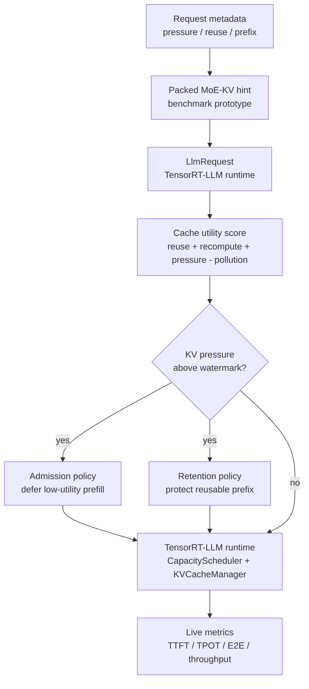
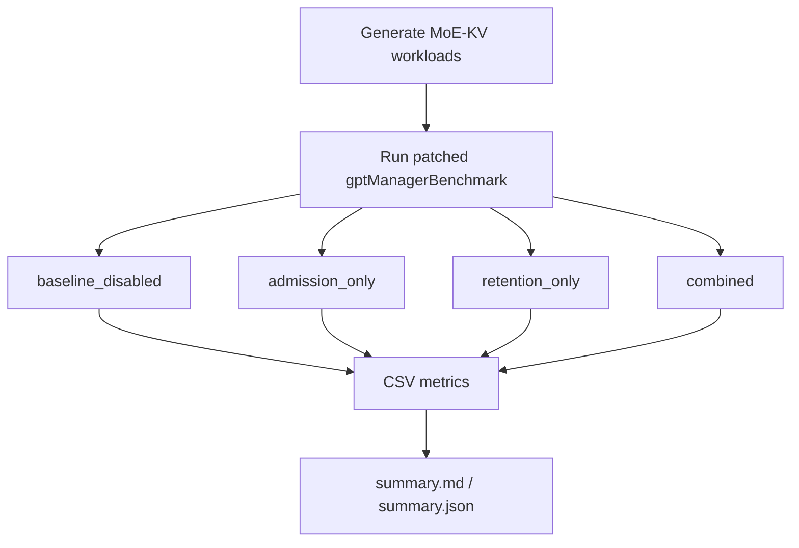

<h1 align="center">TensorRT-LLM MoE KV Scheduler</h1>

<p align="center">
  <strong>MoE-aware KV-pressure scheduling for the TensorRT-LLM C++ runtime.</strong>
</p>

<p align="center">
  <a href="https://github.com/NVIDIA/TensorRT-LLM"></a>
  <a href="https://developer.nvidia.com/cuda-toolkit"></a>
  <a href="https://www.python.org/"></a>
  
  <a href="results/moe_kv_scheduling_live/compare_tables/live_summary.md"></a>
  <a href="LICENSE"></a>
</p>

<p align="center">
  <strong>Best measured result:</strong> <code>mixed_burst + admission_only</code> improves <strong>TPOT p90 by 4.48%</strong> and <strong>throughput by 3.40%</strong> on a live TensorRT-LLM MoE engine.
</p>

---

## What This Project Does

This repository provides a default-off TensorRT-LLM runtime patch for MoE inference. It adds a cache-utility signal to guide two decisions under paged KV cache pressure:

| Runtime decision | What changes |
| --- | --- |
| Request admission | Prefer high-reuse, high-recompute-cost requests before low-reuse cache-polluting prompts. |
| Prefix retention | Raise retention priority for reusable prefix KV blocks through TensorRT-LLM's existing `KvCacheRetentionConfig`. |

It does **not** replace TensorRT-LLM, implement a new serving engine, or rewrite MoE kernels. The project is a focused performance-engineering patch inside the TensorRT-LLM C++ batch manager and KV cache path.

## Result Snapshot

Validated with a TensorRT-LLM INT4 weight-only engine for `Qwen/Qwen1.5-MoE-A2.7B-Chat`.

| Workload | Mode | TTFT p90 | TPOT p90 | E2E p90 | Throughput |
| --- | --- | ---: | ---: | ---: | ---: |
| `mixed_burst` | `admission_only` | **-3.42%** | **-4.48%** | **-2.39%** | **+3.40%** |

The improvement is workload-sensitive. It appears on a mixed high-reuse / low-reuse KV-pressure workload, not as a universal TensorRT-LLM speedup. Full raw values and deltas are published in [live_summary.md](results/moe_kv_scheduling_live/compare_tables/live_summary.md).

## Why KV Scheduling Matters for MoE

In MoE serving, cached prefixes do not all have the same value. A long prompt with little future reuse can occupy many KV blocks and evict a shared prefix that will be reused by later requests. Recomputing that prefix can also re-trigger expensive MoE prefill work.

The patch estimates request cache value before scarce KV blocks are allocated:

```text
cache_utility =
  prefix_reuse_value
  + recompute_cost
  + moe_pressure_cost
  - cache_pollution_cost
```

When KV usage crosses a configured high watermark, the scheduler can defer low-utility first-context requests and admit higher-utility shared-prefix requests first.

## Architecture



The current benchmark path carries metadata through a compact packed hint. A production integration should use a first-class request metadata channel from the serving router, gate estimator, or runtime telemetry layer.

## Patch Surface

| Area | TensorRT-LLM files | Purpose |
| --- | --- | --- |
| Signal ingress | `benchmarks/cpp/utils/utils.{h,cpp}`, `benchmarks/cpp/gptManagerBenchmark.cpp` | Parse MoE/KV metadata from benchmark workloads and attach it to executor requests. |
| Shared policy logic | `cpp/include/tensorrt_llm/batch_manager/moeKvSchedulingPolicy.h` | Keep env config, hint encoding, KV pressure calculation, and cache-utility scoring isolated. |
| Request metadata access | `cpp/include/tensorrt_llm/batch_manager/llmRequest.h` | Expose request metadata to the batch manager. |
| Admission scheduling | `cpp/tensorrt_llm/batch_manager/capacityScheduler.cpp` | Defer low-utility first-context requests under KV pressure when better candidates are waiting. |
| Prefix retention | `cpp/tensorrt_llm/batch_manager/kvCacheManager.cpp` | Use cache utility to generate retention priority for reusable prefix ranges. |

Main runtime patch:

```text
trtllm_patch/0001-moe-aware-kv-scheduling.patch
```

Optional local build patch:

```text
trtllm_patch/0000-local-build-fixes.patch
```

The build patch records workspace-specific CMake/Conan fixes and is not part of the scheduling method.

## Benchmark Workloads



| Workload | Purpose |
| --- | --- |
| `balanced_control` | Low-pressure control workload. The policy should not meaningfully help here. |
| `repeated_prefix_hot_pressure` | Many requests share hot prefixes. Tests whether retention alone protects useful KV blocks. |
| `mixed_burst` | Low-reuse prompts arrive before high-reuse shared-prefix requests. This is the target pressure scenario. |
| `low_reuse_pollution` | Long unique prompts with low reuse. Tests whether the policy over-protects bad cache residents. |

## Benchmark Results

| Item | Value |
| --- | --- |
| GPU | NVIDIA GeForce RTX 4060 Ti, 16 GB |
| Model | `Qwen/Qwen1.5-MoE-A2.7B-Chat` |
| Engine | TensorRT-LLM INT4 weight-only |
| Runtime | TensorRT-LLM C++ `gptManagerBenchmark` |
| Scheduling policy | `max_utilization` |
| Samples | 64 per workload and mode |
| Concurrency | 4 |
| Baseline | Same patched binary with MoE KV scheduling disabled |

Latency deltas are lower-is-better. Throughput deltas are higher-is-better.

| Workload | Mode | TTFT p90 | TPOT p90 | E2E p90 | Throughput |
| --- | --- | ---: | ---: | ---: | ---: |
| `balanced_control` | `admission_only` | +1.16% | +1.22% | +0.86% | -0.41% |
| `balanced_control` | `retention_only` | +1.08% | +0.94% | +0.71% | -0.18% |
| `balanced_control` | `combined` | +7.47% | +7.87% | +4.73% | -4.27% |
| `repeated_prefix_hot_pressure` | `admission_only` | +0.92% | +2.03% | +2.43% | -0.94% |
| `repeated_prefix_hot_pressure` | `retention_only` | +0.02% | +0.65% | +1.24% | +0.11% |
| `repeated_prefix_hot_pressure` | `combined` | -0.02% | +1.32% | +1.01% | -0.75% |
| `mixed_burst` | `admission_only` | **-3.42%** | **-4.48%** | **-2.39%** | **+3.40%** |
| `mixed_burst` | `retention_only` | +0.12% | -1.40% | +2.29% | +0.49% |
| `mixed_burst` | `combined` | -3.00% | -3.54% | -0.38% | +1.93% |
| `low_reuse_pollution` | `admission_only` | +0.46% | +0.79% | -0.31% | -0.34% |
| `low_reuse_pollution` | `retention_only` | -1.04% | -1.03% | -2.30% | -0.88% |
| `low_reuse_pollution` | `combined` | +2.15% | +0.39% | +3.91% | -1.84% |

## Quick Start

Clone this repository:

```bash
git clone https://github.com/LongWeihan/trtllm-moe-kv-scheduler.git
cd trtllm-moe-kv-scheduler
```

Apply the runtime patch to a clean TensorRT-LLM checkout:

```bash
cd /workspace/TensorRT-LLM
git apply /workspace/project/trtllm_patch/0001-moe-aware-kv-scheduling.patch
```

Build TensorRT-LLM with your normal build flow, then run the live benchmark matrix with a compatible engine:

```bash
PROJECT_DIR=/workspace/project \
TRTLLM_DIR=/workspace/TensorRT-LLM \
ENGINE_DIR=/workspace/engine \
bash scripts/run_moe_kv_scheduling_live_matrix.sh
```

Summarize benchmark CSVs:

```bash
python3 scripts/summarize_moe_kv_scheduling_live.py
```

## Runtime Modes

| Mode | Environment | Behavior |
| --- | --- | --- |
| `baseline_disabled` | no policy env vars | TensorRT-LLM behavior with the policy disabled |
| `admission_only` | `TRTLLM_MOE_KV_ADMISSION_ENABLE=1` | KV-pressure-gated request admission |
| `retention_only` | `TRTLLM_MOE_KV_RETENTION_ENABLE=1` | Score-aware reusable-prefix retention |
| `combined` | both env vars enabled | Admission and retention together |

Benchmark runner defaults:

```bash
TRTLLM_MOE_KV_HIGH_WATERMARK_PCT=50
TRTLLM_MOE_KV_WEIGHT_REUSE=1.35
TRTLLM_MOE_KV_WEIGHT_RECOMPUTE=1.00
TRTLLM_MOE_KV_WEIGHT_PRESSURE=0.55
TRTLLM_MOE_KV_WEIGHT_POLLUTION=1.10
TRTLLM_MOE_KV_MIN_ADMIT_UTILITY=35
TRTLLM_MOE_KV_DEFER_MARGIN=8
TRTLLM_MOE_KV_PREFIX_PRIORITY_BASE=45
TRTLLM_MOE_KV_PREFIX_PRIORITY_MAX=95
TRTLLM_MOE_KV_DURATION_MS=9000
```

## Repository Layout

```text
.
├── docs/
│   ├── architecture.md
│   ├── benchmark_results.md
│   └── build_and_reproduce.md
├── results/
│   └── moe_kv_scheduling_live/compare_tables/
├── scripts/
│   ├── generate_moe_kv_scheduling_workloads.py
│   ├── run_moe_kv_scheduling_live_matrix.sh
│   └── summarize_moe_kv_scheduling_live.py
├── trtllm_patch/
│   ├── 0000-local-build-fixes.patch
│   └── 0001-moe-aware-kv-scheduling.patch
└── workloads/
    └── moe_kv_scheduling/
```

## Documentation

- [Architecture](docs/architecture.md)
- [Benchmark results](docs/benchmark_results.md)
- [Build and reproduction notes](docs/build_and_reproduce.md)

## Limitations

- This is an external TensorRT-LLM runtime patch. It is not affiliated with or endorsed by NVIDIA.
- The benchmark uses `synthetic_hint` metadata, not live selected-expert telemetry from the TensorRT engine.
- The published run is single-GPU and does not claim distributed expert-parallel or cross-rank KV-cache gains.
- The baseline is the same patched binary with MoE KV scheduling disabled through environment variables.
- Engine files, model weights, generated logs, and local build artifacts are intentionally not committed.

## License

Apache-2.0. See [LICENSE](LICENSE).
