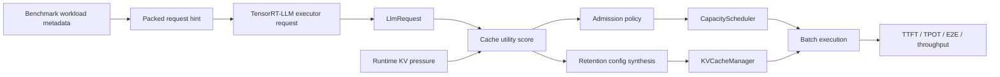
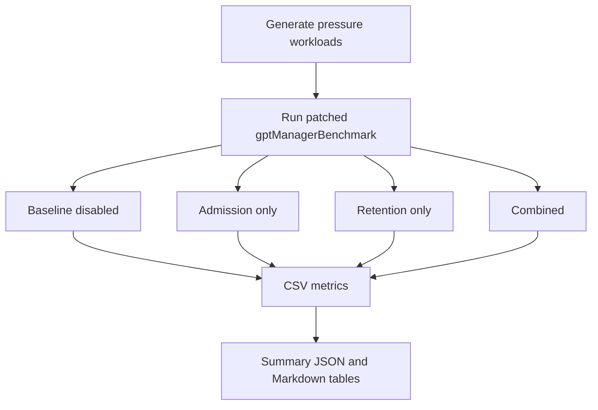

# TensorRT-LLM MoE KV Scheduler

[](LICENSE)
[](https://github.com/NVIDIA/TensorRT-LLM)


MoE-aware request admission and KV cache retention policy for NVIDIA TensorRT-LLM.

This project extends the TensorRT-LLM C++ runtime path with a cache-utility signal that combines prefix reuse, recompute cost, MoE pressure, and cache pollution risk. The policy is default-off and can be enabled at runtime through environment variables, allowing the same patched binary to run baseline, admission-only, retention-only, and combined modes.

The implementation is evaluated with a real TensorRT-LLM engine for `Qwen/Qwen1.5-MoE-A2.7B-Chat` using INT4 weight-only quantization on a single RTX 4060 Ti 16 GB setup.

## Highlights

| Capability | Status |
| --- | --- |
| TensorRT-LLM C++ runtime patch | Implemented |
| KV-pressure-gated request admission | Implemented |
| Score-aware prefix retention | Implemented |
| Qwen1.5-MoE INT4 live benchmark | Completed |
| Runtime router telemetry | Future production extension |
| Direct allocator rewrite | Not required for this prototype |

## Repository Layout

```text
.
├── docs/
│   ├── architecture.md
│   ├── benchmark_results.md
│   └── build_and_reproduce.md
├── results/
│   └── moe_kv_scheduling_live/compare_tables/
├── scripts/
│   ├── generate_moe_kv_scheduling_workloads.py
│   ├── run_moe_kv_scheduling_live_matrix.sh
│   └── summarize_moe_kv_scheduling_live.py
├── trtllm_patch/
│   ├── 0000-local-build-fixes.patch
│   └── 0001-moe-aware-kv-scheduling.patch
└── workloads/
    └── moe_kv_scheduling/
```

## Quick Start

```bash
git clone https://github.com/LongWeihan/trtllm-moe-kv-scheduler.git
cd trtllm-moe-kv-scheduler
```

Apply the optimization patch to a clean TensorRT-LLM checkout:

```bash
cd /workspace/TensorRT-LLM
git apply /workspace/project/trtllm_patch/0001-moe-aware-kv-scheduling.patch
```

Run the benchmark matrix after building TensorRT-LLM and preparing an engine:

```bash
PROJECT_DIR=/workspace/project \
TRTLLM_DIR=/workspace/TensorRT-LLM \
ENGINE_DIR=/workspace/engine \
bash scripts/run_moe_kv_scheduling_live_matrix.sh
```

## Why This Exists

TensorRT-LLM already has a highly optimized execution stack, so a useful project should avoid reimplementing kernels or duplicating runtime behavior. The target here is narrower: under KV cache pressure, MoE serving has requests whose cached prefixes are not equally valuable.

A low-reuse long prompt can consume many KV blocks and evict a shared prefix that will be reused by many later requests. For MoE models, recomputing that prefix can also hit hot experts again, amplifying prefill cost. A generic first-come admission path does not know that difference.

This patch injects a small MoE-aware scheduling signal into the existing TensorRT-LLM runtime:

```text
cache_utility =
  prefix_reuse_value
  + recompute_cost
  + moe_pressure_cost
  - cache_pollution_cost
```

Higher utility means the request is more valuable to admit under KV pressure and its reusable prefix is more valuable to retain.

## Architecture



The prototype transports metadata through `clientId` in the benchmark path. That keeps the patch compact and avoids changing TensorRT-LLM public request APIs. A production version should replace this with a first-class request metadata channel from a router, gate estimator, or serving frontend.

## What Changed

| Area | Files | Change | Reason |
| --- | --- | --- | --- |
| Signal ingress | `benchmarks/cpp/utils/*`, `gptManagerBenchmark.cpp` | Parses `moe_pressure_score`, `reuse_group`, `shared_prefix_tokens`, `estimated_kv_blocks`, `expected_reuse_count`, and `signal_source`; packs them into request metadata. | The scheduler needs per-request reuse and pressure hints before admission. |
| Shared policy logic | `moeKvSchedulingPolicy.h` | Adds env config, hint pack/unpack, KV pressure calculation, and cache utility scoring. | Keeps policy math isolated from allocator internals. |
| Request access | `llmRequest.h` | Exposes `getClientId()` to the batch manager. | Lets runtime policy recover benchmark metadata from `LlmRequest`. |
| Admission scheduling | `capacityScheduler.cpp` | Under a KV high watermark, defers low-utility first-context requests when a later high-utility request is waiting. | Prevents low-reuse prompts from consuming scarce KV blocks ahead of high-reuse prefixes. |
| Retention policy | `kvCacheManager.cpp` | Synthesizes `KvCacheRetentionConfig` for high-value shared prefix ranges when no explicit config is present. | Reuses TensorRT-LLM's existing priority-based eviction machinery instead of rewriting block allocation. |

## Runtime Modes

| Mode | Environment |
| --- | --- |
| Baseline disabled | No MoE KV scheduling env vars set. |
| Admission only | `TRTLLM_MOE_KV_ADMISSION_ENABLE=1` |
| Retention only | `TRTLLM_MOE_KV_RETENTION_ENABLE=1` |
| Combined | `TRTLLM_MOE_KV_ADMISSION_ENABLE=1` and `TRTLLM_MOE_KV_RETENTION_ENABLE=1` |

Important knobs:

```bash
TRTLLM_MOE_KV_HIGH_WATERMARK_PCT=50
TRTLLM_MOE_KV_WEIGHT_REUSE=1.35
TRTLLM_MOE_KV_WEIGHT_RECOMPUTE=1.00
TRTLLM_MOE_KV_WEIGHT_PRESSURE=0.55
TRTLLM_MOE_KV_WEIGHT_POLLUTION=1.10
TRTLLM_MOE_KV_MIN_ADMIT_UTILITY=35
TRTLLM_MOE_KV_DEFER_MARGIN=8
TRTLLM_MOE_KV_PREFIX_PRIORITY_BASE=45
TRTLLM_MOE_KV_PREFIX_PRIORITY_MAX=95
TRTLLM_MOE_KV_DURATION_MS=9000
```

## Benchmark Pipeline



Workloads are synthetic but intentionally structured:

| Workload | Purpose |
| --- | --- |
| `balanced_control` | Balanced low-pressure control. A good policy should not help much and should not regress heavily. |
| `repeated_prefix_hot_pressure` | Many requests share hot prefixes. Tests whether retention alone protects useful prefixes. |
| `mixed_burst` | Front-loaded low-reuse prompts followed by high-reuse shared-prefix traffic. This is the main target scenario. |
| `low_reuse_pollution` | Long unique prompts with low reuse. Tests whether retention/admission avoids over-protecting bad cache residents. |

## Results

Environment used for the live run:

| Item | Value |
| --- | --- |
| GPU | NVIDIA GeForce RTX 4060 Ti, 16 GB |
| Model | `Qwen/Qwen1.5-MoE-A2.7B-Chat` |
| Engine | TensorRT-LLM INT4 weight-only |
| Runtime | TensorRT-LLM C++ `gptManagerBenchmark`, inflight batching |
| Samples | 64 per workload and mode |
| Concurrency | 4 |

Latency deltas are lower-is-better. Throughput deltas are higher-is-better.

| Workload | Mode | TTFT p90 | TPOT p90 | E2E p90 | Throughput |
| --- | --- | ---: | ---: | ---: | ---: |
| balanced_control | admission_only | +1.16% | +1.22% | +0.86% | -0.41% |
| balanced_control | retention_only | +1.08% | +0.94% | +0.71% | -0.18% |
| balanced_control | combined | +7.47% | +7.87% | +4.73% | -4.27% |
| repeated_prefix_hot_pressure | admission_only | +0.92% | +2.03% | +2.43% | -0.94% |
| repeated_prefix_hot_pressure | retention_only | +0.02% | +0.65% | +1.24% | +0.11% |
| repeated_prefix_hot_pressure | combined | -0.02% | +1.32% | +1.01% | -0.75% |
| mixed_burst | admission_only | **-3.42%** | **-4.48%** | **-2.39%** | **+3.40%** |
| mixed_burst | retention_only | +0.12% | -1.40% | +2.29% | +0.49% |
| mixed_burst | combined | -3.00% | -3.54% | -0.38% | +1.93% |
| low_reuse_pollution | admission_only | +0.46% | +0.79% | -0.31% | -0.34% |
| low_reuse_pollution | retention_only | -1.04% | -1.03% | -2.30% | -0.88% |
| low_reuse_pollution | combined | +2.15% | +0.39% | +3.91% | -1.84% |

Raw values are available in:

```text
results/moe_kv_scheduling_live/compare_tables/live_summary.md
results/moe_kv_scheduling_live/compare_tables/live_summary.json
```

## Interpretation

The strongest result is `mixed_burst` with admission-only scheduling: TTFT p90 improves by 3.42%, TPOT p90 improves by 4.48%, E2E p90 improves by 2.39%, and token throughput improves by 3.40%.

That is the workload where the policy has a clear decision to make: early low-reuse prompts would occupy KV blocks before later shared-prefix requests arrive. Admission control can defer lower-utility first-context requests and admit higher-utility shared-prefix requests earlier once KV pressure crosses the watermark.

The result is intentionally not presented as a universal speedup. Balanced control and repeated-prefix workloads are mostly neutral or slightly worse. In those cases the policy either has little useful discrimination signal or adds scheduling overhead without changing a harmful admission order. This is expected for a pressure-gated policy and is why the knobs are default-off.

Retention-only remains a weaker lever. It adjusts block priority after a request has already been admitted, while admission control changes the batch composition before scarce KV blocks are allocated.

## Reproduce

Apply the optimization patch to a clean TensorRT-LLM checkout:

```bash
cd /workspace/TensorRT-LLM
git apply /workspace/project/trtllm_patch/0001-moe-aware-kv-scheduling.patch
```

If your local build environment has the same Conan/Torch runtime linkage issue observed in this workspace, apply the local build patch as well:

```bash
git apply /workspace/project/trtllm_patch/0000-local-build-fixes.patch
```

Build the C++ runtime and benchmark target with your TensorRT-LLM build flow. The successful run in this workspace produced:

```text
cpp/build/tensorrt_llm/libtensorrt_llm.so
cpp/build/benchmarks/gptManagerBenchmark
```

Generate workloads:

```bash
python3 scripts/generate_moe_kv_scheduling_workloads.py
```

Run the live matrix:

```bash
PROJECT_DIR=/workspace/project \
TRTLLM_DIR=/workspace/TensorRT-LLM \
ENGINE_DIR=/workspace/engine \
bash scripts/run_moe_kv_scheduling_live_matrix.sh
```

Summarize existing CSV outputs:

```bash
python3 scripts/summarize_moe_kv_scheduling_live.py
```

## Artifacts

| Artifact | Path |
| --- | --- |
| Main TensorRT-LLM patch | `trtllm_patch/0001-moe-aware-kv-scheduling.patch` |
| Local build fix patch | `trtllm_patch/0000-local-build-fixes.patch` |
| Workloads | `workloads/moe_kv_scheduling/` |
| Raw run logs | `logs/moe_kv_scheduling_live/` |
| Result tables | `results/moe_kv_scheduling_live/compare_tables/` |

## Limitations

This is a runtime scheduling prototype, not an upstream TensorRT-LLM feature. It is not affiliated with or endorsed by NVIDIA.

The current signal source is `synthetic_hint`, generated by benchmark workload metadata. It is not live router telemetry from the TensorRT engine. A production path should feed router or serving-layer metadata through an explicit request metadata API.

The benchmark is single-GPU. It does not claim multi-GPU expert-parallel behavior, cross-rank KV movement, or distributed serving gains.

The baseline is the same patched binary with MoE KV scheduling disabled through environment variables. This isolates policy effect while avoiding binary-to-binary build drift.

One extra pressure-sweep run with a smaller KV budget was excluded from headline results because TensorRT-LLM reduced max sequence length and output length, making it not comparable to the main workload.
