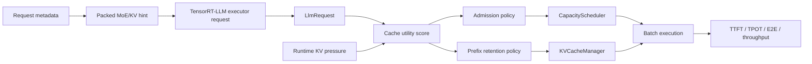

# TensorRT-LLM MoE KV Scheduler

[](https://github.com/NVIDIA/TensorRT-LLM)
[](https://developer.nvidia.com/cuda-toolkit)
[](https://www.python.org/)
[](LICENSE)

[](#)
[](trtllm_patch/0001-moe-aware-kv-scheduling.patch)
[](results/moe_kv_scheduling_live/compare_tables/live_summary.md)

MoE-aware request admission and prefix KV retention for TensorRT-LLM.

This repository provides a compact TensorRT-LLM runtime patch that uses request-level MoE pressure and prefix-reuse hints to make better scheduling decisions when paged KV cache is under pressure. It is designed as a default-off policy layer on top of TensorRT-LLM, not as a replacement for TensorRT-LLM, a new inference server, or a custom MoE kernel.

## Highlights

- Patches the TensorRT-LLM C++ runtime path instead of reimplementing inference.
- Adds KV-pressure-gated request admission in `CapacityScheduler`.
- Adds score-aware prefix retention through TensorRT-LLM's existing `KvCacheRetentionConfig`.
- Keeps the policy default-off and controlled by environment variables.
- Ships with reproducible workloads, scripts, patch files, architecture notes, and live benchmark summaries.

## Performance Snapshot

Validated with a TensorRT-LLM INT4 weight-only engine for `Qwen/Qwen1.5-MoE-A2.7B-Chat`.

| Workload | Best mode | TTFT p90 | TPOT p90 | E2E p90 | Throughput |
| --- | --- | ---: | ---: | ---: | ---: |
| `mixed_burst` | `admission_only` | **-3.42%** | **-4.48%** | **-2.39%** | **+3.40%** |

The full benchmark table is available in [results/moe_kv_scheduling_live/compare_tables/live_summary.md](results/moe_kv_scheduling_live/compare_tables/live_summary.md).

The improvement is workload-sensitive: this policy is most useful when low-reuse long prompts compete with high-reuse shared-prefix requests under KV pressure. It is not presented as a universal TensorRT-LLM speedup.

## How It Works

The patch assigns each request a lightweight cache-utility score:

```text
cache_utility =
  prefix_reuse_value
  + recompute_cost
  + moe_pressure_cost
  - cache_pollution_cost
```

When KV usage crosses a configurable watermark, the scheduler can admit high-utility shared-prefix requests before low-utility cache-polluting requests. The same score can also raise retention priority for reusable prefix ranges.



Current benchmark metadata uses `synthetic_hint`. A production integration should feed equivalent metadata from a serving router, gate estimator, or runtime telemetry path.

## Repository Layout

```text
.
├── docs/                 # Architecture, benchmark interpretation, reproduction notes
├── results/              # Published benchmark summary tables
├── scripts/              # Workload generation, live benchmark runner, summarizer
├── trtllm_patch/         # TensorRT-LLM patch series
└── workloads/            # Reproducible MoE/KV pressure workloads
```

## Quick Start

Clone this repository:

```bash
git clone https://github.com/LongWeihan/trtllm-moe-kv-scheduler.git
cd trtllm-moe-kv-scheduler
```

Apply the runtime patch to a clean TensorRT-LLM checkout:

```bash
cd /workspace/TensorRT-LLM
git apply /workspace/project/trtllm_patch/0001-moe-aware-kv-scheduling.patch
```

Build TensorRT-LLM with your normal build flow, then run the live benchmark matrix with a compatible engine:

```bash
PROJECT_DIR=/workspace/project \
TRTLLM_DIR=/workspace/TensorRT-LLM \
ENGINE_DIR=/workspace/engine \
bash scripts/run_moe_kv_scheduling_live_matrix.sh
```

Summarize benchmark CSVs:

```bash
python3 scripts/summarize_moe_kv_scheduling_live.py
```

## Runtime Modes

| Mode | Environment | Behavior |
| --- | --- | --- |
| `baseline_disabled` | no policy env vars | TensorRT-LLM behavior with the new policy disabled |
| `admission_only` | `TRTLLM_MOE_KV_ADMISSION_ENABLE=1` | KV-pressure-gated request admission |
| `retention_only` | `TRTLLM_MOE_KV_RETENTION_ENABLE=1` | Score-aware reusable-prefix retention |
| `combined` | both env vars enabled | Admission and retention together |

Default tuning knobs used by the benchmark runner:

```bash
TRTLLM_MOE_KV_HIGH_WATERMARK_PCT=50
TRTLLM_MOE_KV_WEIGHT_REUSE=1.35
TRTLLM_MOE_KV_WEIGHT_RECOMPUTE=1.00
TRTLLM_MOE_KV_WEIGHT_PRESSURE=0.55
TRTLLM_MOE_KV_WEIGHT_POLLUTION=1.10
TRTLLM_MOE_KV_MIN_ADMIT_UTILITY=35
TRTLLM_MOE_KV_DEFER_MARGIN=8
TRTLLM_MOE_KV_PREFIX_PRIORITY_BASE=45
TRTLLM_MOE_KV_PREFIX_PRIORITY_MAX=95
TRTLLM_MOE_KV_DURATION_MS=9000
```

## Patch Surface

| Area | TensorRT-LLM files |
| --- | --- |
| Benchmark signal ingress | `benchmarks/cpp/utils/utils.{h,cpp}`, `benchmarks/cpp/gptManagerBenchmark.cpp` |
| Shared policy logic | `cpp/include/tensorrt_llm/batch_manager/moeKvSchedulingPolicy.h` |
| Request metadata access | `cpp/include/tensorrt_llm/batch_manager/llmRequest.h` |
| Admission scheduling | `cpp/tensorrt_llm/batch_manager/capacityScheduler.cpp` |
| Prefix retention | `cpp/tensorrt_llm/batch_manager/kvCacheManager.cpp` |

The main patch is [trtllm_patch/0001-moe-aware-kv-scheduling.patch](trtllm_patch/0001-moe-aware-kv-scheduling.patch). The optional [trtllm_patch/0000-local-build-fixes.patch](trtllm_patch/0000-local-build-fixes.patch) records local build-environment fixes and is not part of the scheduling method.

## Documentation

- [Architecture](docs/architecture.md)
- [Benchmark results](docs/benchmark_results.md)
- [Build and reproduction notes](docs/build_and_reproduce.md)

## Limitations

- This project is an external TensorRT-LLM runtime patch. It is not affiliated with or endorsed by NVIDIA.
- The benchmark uses `synthetic_hint` metadata, not live selected-expert telemetry from the TensorRT engine.
- The published run is single-GPU and does not claim distributed expert-parallel or cross-rank KV-cache improvements.
- Engine files, model weights, generated logs, and local build artifacts are intentionally not committed.

## License

Apache-2.0. See [LICENSE](LICENSE).
