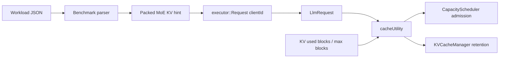

# Architecture

## Goal

The project adds a default-off MoE-aware scheduling layer inside the TensorRT-LLM C++ runtime path. The goal is not to rewrite kernels or duplicate TensorRT-LLM execution. The goal is to give existing admission and KV retention logic a better request-level signal when KV cache is under pressure.

## Data Flow



The benchmark parser accepts the following fields:

```text
moe_pressure_score
reuse_group
shared_prefix_tokens
estimated_kv_blocks
expected_reuse_count
signal_source
```

Those fields are packed into a 64-bit hint. The runtime later unpacks the hint from `LlmRequest::getClientId()`.

## Cache Utility

```text
cache_utility =
  prefix_reuse_value
  + recompute_cost
  + moe_pressure_cost
  - cache_pollution_cost
```

The score is deterministic for the same request metadata and tokens-per-block setting. It is controlled by environment variables so that the same patched binary can run as baseline, admission-only, retention-only, or combined.

## Admission

Admission is gated by `TRTLLM_MOE_KV_HIGH_WATERMARK_PCT`. Below the watermark, TensorRT-LLM behavior is preserved. Above the watermark, the max-utilization scheduler can defer a low-utility first-context request if a later high-utility first-context request is waiting.

This targets the case where a low-reuse long prompt would otherwise allocate KV blocks first and evict or block a high-reuse shared-prefix request.

## Retention

When retention is enabled and a request has a shared prefix hint, `KVCacheManager` synthesizes a `KvCacheRetentionConfig` for the prefix token range if the request does not already provide one. The priority is derived from cache utility and passed into TensorRT-LLM's existing retention/eviction mechanism.

## Prototype Boundary

The metadata transport through `clientId` is intentionally limited to this benchmark prototype. A production design should use an explicit metadata field or a serving frontend side channel. The current benchmark uses `synthetic_hint`, not live selected-expert counters from the TensorRT engine.
